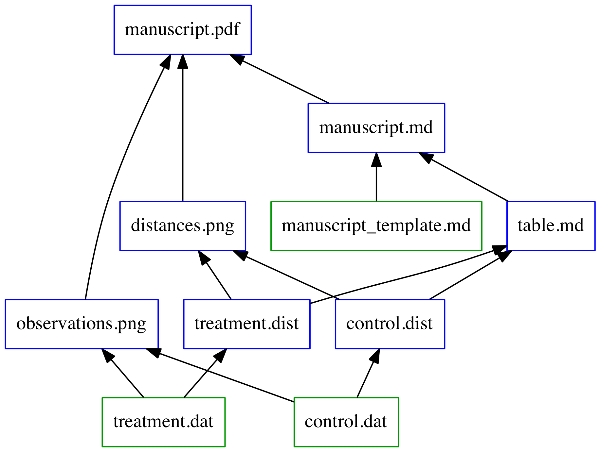

% Reproducibility
% for Bioinformatics Projects
% Daniel S. Standage, 3 Sept 2014

<style type="text/css">
  h1 { margin-bottom: 0.5em !important; }
</style>

# Reproducibility in Science

##

<a href="http://xkcd.com/242/">
  <image src="xkcd-242.png" width="300" alt="Reproducibility" />
</a>  
http://xkcd.com/242/

## Reproducibility

- central pillar of scientific method
- requires good habits, dedication
- will save you (and others) time and stress

# Facilitating Reproducibility

## \[ree-pr*uh*-**doos**\]

1. I give you my solution (code, data, parameters), you run it and get the same output
1. I give you a description of my solution, you implement it and get same/similar result

<br />
It's important to facilitate both as much as possible!

## Key enablers

- organization
- automation
- documentation
- ~~version control~~ versionation

# Project Organization

## How to organize your project

- many ways to do it, find something that works for you
- beyond scope of this discussion
- example with salient points:  
[**Noble WS** (2009) A Quick Guide to Organizing Computational Biology Projects. *PLoS Computational Biology*, **5**(7):e1000424.](http://dx.doi.org/10.1371/journal.pcbi.1000424)

# Automation

## Why automate?

- You **_will_** have to run your workflow again!
    - you get more data
    - you discover a flaw in your analysis
    - you need to try new parameters
    - your computer crashes
- It saves you time
    - you delegate tedious tasks to the computer
    - you don't have to babysit the terminal

## How to automate?

- shell scripts
    - simple
    - familiar
- make files (more on this later)
    - awkward syntax
    - more complex
    - powerful features

# Project Documentation

## What to document?

- describe steps of a workflow
- note software versions
- defend important parameter choices
- list issues you've identified and/or overcome
- record commands you have not yet automated

## How to document it?

- README files
- wiki pages
- blogs

# Version control

## Concept

- take periodic snapshots of your project
- maintain searchable, usable project history
- manage work across multiple machines

## Benefits of version control

- facilitates reviewing old code, data, and results
- facilitates collaboration
- provides backup

## Version control systems

- CVS
- Subversion
- git (more on this later)

# More on Make

## Outline

- concepts
- syntax
- hands-on example

## Make: concepts

- targets
- prerequisites
- instructions (recipe)

## Make: syntax

```make
target:  prerequisite(s)
         build command(s)
```

## Make: simple example

```make
SRR001665.sam:        SRR001665_1.sai SRR001665_2.sai MG1655.fasta
                      bwa sampe MG1655.fasta SRR001665_1.sai SRR001665_2.sai SRR001665_1.fastq SRR001665_2.fastq

SRR001665_1.sai:      SRR001665_1.fastq MG1655.fasta
                      bwa aln MG1566.fasta SRR001665_1.fastq > SRR001665_1.sai

SRR001665_2.sai:      SRR001665_2.fastq MG1655.fasta
                      bwa aln MG1566.fasta SRR001665_2.fastq > SRR001665_2.sai

SRR001665_1.fastq:    SRR001665_1.fastq.gz
                      gunzip SRR001665_1.fastq.gz

SRR001665_2.fastq:    SRR001665_2.fastq.gz
                      gunzip SRR001665_2.fastq.gz
```

## Benefits of Make

- only rebuilds prerequisites if they are outdated
- can build independent targets in parallel
- *de facto* checkpointing and fault tolerance
- wildcards and patterns provide flexibility

## Example


